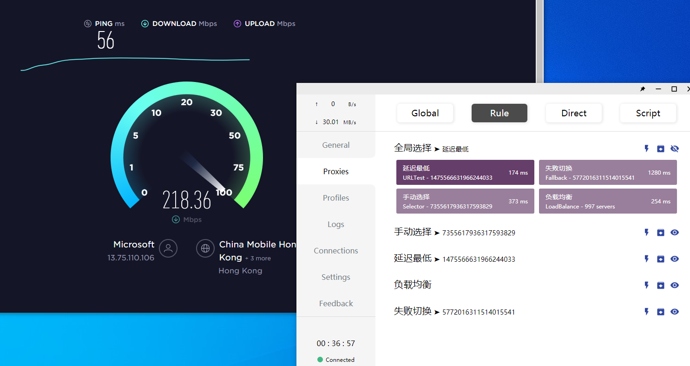

<h1 align="center">
  <br>proxypool<br>
</h1>

<h5 align="center">自动抓取tg频道、订阅地址、公开互联网上的ss、ssr、vmess节点信息，聚合去重后提供节点列表</h5>

<p align="center">
  <a href="https://github.com/zu1k/proxypool/actions">
    
  </a>
  <a href="https://goreportcard.com/report/github.com/zu1k/proxypool">
    
  </a>
  <a href="https://github.com/zu1k/proxypool/releases">
    
  </a>
</p>

## 支持

- 支持ss、ssr、vmess节点链接与订阅
- 任意 Telegram 频道抓取
- 机场订阅地址抓取解析
- 公开互联网页面模糊抓取
- 翻墙党论坛新节点信息
- 其他节点分享网站
- 定时抓取更新
- 使用配置文件提供抓取源

## 安装

### 从源码编译

需要安装Golang

```sh
$ go get -u -v github.com/zu1k/proxypool
```

### 下载预编译程序

从这里下载预编译好的程序 [release](https://github.com/zu1k/proxypool/releases)

### 使用docker

```sh
docker pull docker.pkg.github.com/zu1k/proxypool/proxypool:latest
```

## 使用

### 共享抓取配置文件

每一次抓取前会自动从github下载最新的抓取配置文件

直接运行 `proxypool` 程序即可

### 自定义抓取配置文件

```shell
proxypool -c source.yaml
```

### 帮助更新配置文件

可以在 https://github.com/zu1k/proxypool/issues/3 进行留言

### 用户使用

目前公开版本： https://proxy.tgbot.co

直接在clash添加配置文件即可使用： https://proxy.tgbot.co/clash/config

## 截图


